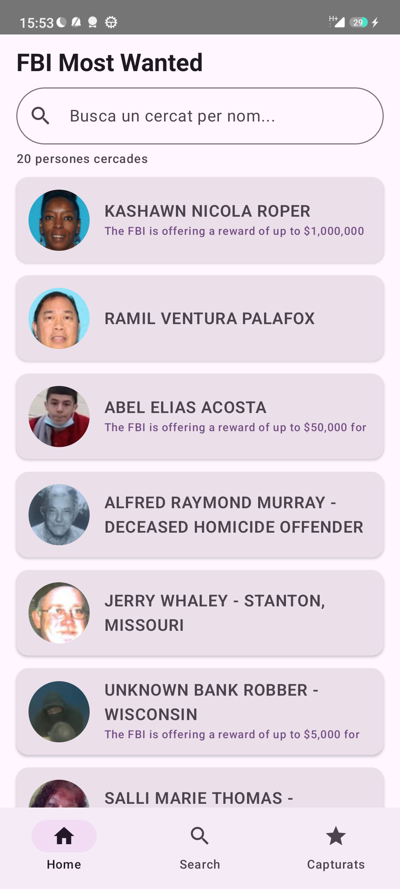
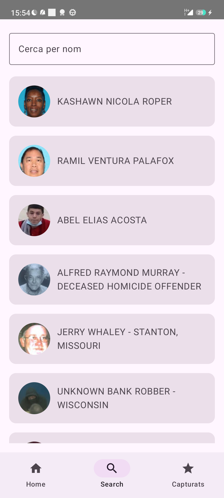
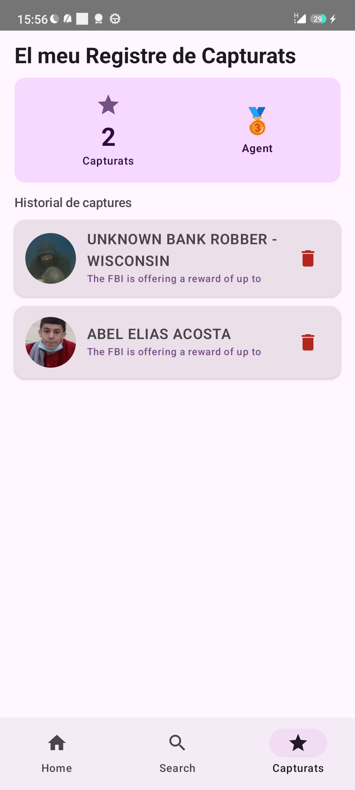
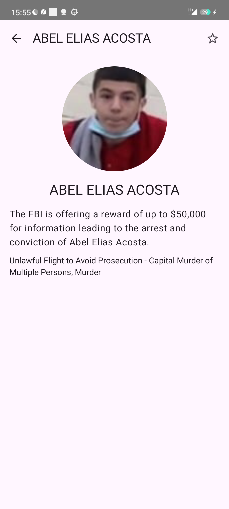

# FBI Bounty Hunter

## Descripció del projecte

FBI Bounty Hunter és una aplicació Android que consumeix l'API pública del FBI (`https://api.fbi.gov/`) per mostrar la llista de persones cercades (Most Wanted). L'usuari actua com a caçador de recompenses: pot explorar la llista, buscar criminals per nom i capturar-los per guardar-los a la seva base de dades local.

## Funcionalitats 

### Room – Persistència local 

Els criminals que l'usuari "captura" es guarden automàticament a la base de dades local `consumapi.db` mitjançant Room. L'entitat `WantedEntity` emmagatzema `uid`, `title`, `imageUrl` i `rewardText`. Les dades persisteixen entre sessions de l'app.

### SearchBar al llistat principal 

La pantalla principal (`Home`) inclou una **SearchBar** integrada al llistat. Filtra en temps real per nom del cercat mentre l'usuari escriu, usant `MediatorLiveData` al ViewModel per combinar el text de cerca amb el llistat de l'API.

### Dinàmica de joc – Caçador de recompenses 

L'app incorpora una mecànica de joc:
- L'usuari captura criminals marcant-los amb l'estrella a la pantalla de detall.
- A la pantalla "Capturats" es veu un tauler de puntuació amb el rang assolit:
  - Novell (0 capturats)
  - Agent (1-2)
  - Investigador (3-6)
  - Agent Senior (7-14)
  - Agent Llegenda (15+)
- Des de la pantalla de capturats es pot alliberar (eliminar de Room) qualsevol criminal amb el botó de la paperera.

## Pantalles de l'aplicació

### 1. Pantalla principal – Llistat (Home)

La pantalla principal mostra tots els criminals cercats descarregats de l'API del FBI. Inclou una SearchBar a la part superior per filtrar per nom en temps real.

### 2. Pantalla de Cerca (Search)

Pantalla dedicada a la cerca amb camp de text. Mostra els resultats filtrats.

### 3. Pantalla de Detall

Mostra la foto, nom, descripció i recompensa del criminal. L'estrella a dalt a la dreta captura o allibera el criminal (desa/elimina de Room).

### 4. Pantalla de Capturats

Mostra tots els criminals capturats (guardats a Room). Inclou el tauler de rang del joc i un botó per alliberar cada criminal de la BD local.

## API utilitzada

**FBI Wanted API** – `https://api.fbi.gov/`

- Endpoint principal: `GET /wanted/v1/list?page=1&pageSize=20`
- No requereix cap clau d'autenticació (token)
- Retorna llistat de persones cercades amb nom, descripció, recompensa i imatges
